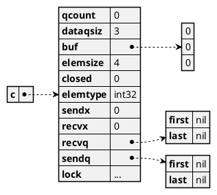

## Why

Chanenls are an integral part of Go's concurrency primitives, together with goroutines. There is a famous slogan from [Effective Go](https://golang.org/doc/effective_go#sharing):

> Do not communicate by sharing memory; instead, share memory by communicating.

and channels is how you communicate in Go. Go's approach to concurrency is my personal favorite, as 

## Where

The type underlying all channel types in Go is `hchan` (in `runtime/chan.go`[^1]). You can find the definition of `hchan` and the implementation of channel operations there. GitHub link [here](https://github.com/golang/go/blob/go1.14.2/src/runtime/chan.go).

## What

Channel is implemented as `hchan` struct in go, and its definition is as follows:

```go
type hchan struct {
	qcount   uint           // total data in the queue
	dataqsiz uint           // size of the circular queue
	buf      unsafe.Pointer // points to an array of dataqsiz elements
	elemsize uint16
	closed   uint32
	elemtype *_type // element type
	sendx    uint   // send index
	recvx    uint   // receive index
	recvq    waitq  // list of recv waiters
	sendq    waitq  // list of send waiters

	// lock protects all fields in hchan, as well as several
	// fields in sudogs blocked on this channel.
	//
	// Do not change another G's status while holding this lock
	// (in particular, do not ready a G), as this can deadlock
	// with stack shrinking.
	lock mutex
}

type waitq struct {
	first *sudog // sudog represents a goroutine in a wait list
	last  *sudog
}
```

### Observations

- channel buffer is implemented as a [circular queue](https://en.wikipedia.org/wiki/Circular_buffer), aka circular buffer, ring buffer
  - `buf`: pointer to an array of `dataqsiz` elements, containing the data in queue
  - `sendx`: index of the next element sent to buffer(0 initially)
  - `recvx`: index of the next element received from buffer(0 initially)
- goroutines blocked by send/receive operations are queued in `recvq` and `sendq`
- channels are synchronized with mutex

## How

There are roughly speaking 4 things you can do with a channel:

```go
c := make(chan int32, 3)  // 1. create a new channel
c <- 123                  // 2. send value to a channel
x := <-c                  // 3. receive value from a channel
close(c)                  // 4. close a channel
```

I added "roughly speaking" because sending and receiving can either block or not depending on the context. For example, you can do non-blocking send and receive opeartions `select` statements. That is not a problem, though, because almost all channel operations are implemented in just 4 functions in `runtime/chan.go`:

| Operation                    | Code                  | Implemented where? |
| ---------------------------- | --------------------- | ------------------ |
| create a new channel         | `make(chan int32, 3)` | `makechan`         |
| send value to a channel      | `c <- 123`            | `chansend`         |
| receive value from a channel | `x := <-c`            | `chanrecv`         |
| close a channel              | `close(c)`            | `closechan`        |

Next, we will be looking inside the 4 functions and learn about the internal working of Go channels.

### Create a new channel - `makechan`

> The complete function signature: `func makechan(t *chantype, size int) *hchan`

In the compilation process, `make` called with a `chan` type gets substituted[^2] with a `makechan64`, which in turn calls `makechan`. `makechan` is where channels are actually made.

```go
c := make(chan int32, 3)
```



This is what happened in `makechan`

- the whole requested buffer space(`c.buf`) of size `size` is allocated.
- `c.elemsize` is set to the byte size of the channel's element type
  - 4 in the example, because `int32`'s size is 4 bytes
- `c.elemtype` is set to the element type of the channel type
- `c.dataqsiz` is set to `size`

### Send value to a channel - `chansend`

> The complete function signature: `func chansend(c *hchan, ep unsafe.Pointer, block bool, callerpc uintptr) bool`

Similar to how `make` calls are converted to `makechan64`, send expressions like `c <- 123` are substituted with calls to `chansend1(c *hchan, elem unsafe.Pointer)` or `selectnbsend(c *hchan, elem unsafe.Pointer) (selected bool)`, depending on whether the send statement is part of a `case` of a `select` statement, both of which inturn calls `chansend`.

```go
// entry point for c <- x from compiled code
//go:nosplit
func chansend1(c *hchan, elem unsafe.Pointer) {
	chansend(c, elem, true, getcallerpc())
}

// compiler implements
//
//	select {
//	case c <- v:
//		... foo
//	default:
//		... bar
//	}
//
// as
//
//	if selectnbsend(c, v) {
//		... foo
//	} else {
//		... bar
//	}
//
func selectnbsend(c *hchan, elem unsafe.Pointer) (selected bool) {
	return chansend(c, elem, false, getcallerpc())
}
```

`chansend` implements a generic version of the send operation. Other than `c`, the destination channel and `ep`, the pointer to the element being send, there are 2 more parameters in `chansend`:

#### `block`

`block` specifies whether the send operation is blocking. Send expressions are normally blocking, i.e., it blocks until there is a slot in the buffer for it, or the element is received by another goroutine. However, that is not always the case. When you send to a channel in a `select` statement, it should not block as only one of the `case` in `select` is supposed to happen. For example, the following `select` statement would only send to `c` if it can be done immediately without blocking.

```go
select{
  case c <- 123:
  // if the send operation cannot be done immediately, the default
  // case is executed, which finishes the `select` statement without
  // sending to the channel.
  default:
}
```

With the `reflect` package, you can even specify whether you want your send operation to be blocking or not by using `Value.Send` or `Value.TrySend`.

#### `callerpc`

Honestly, I am not sure what is for exactly, but it is only used once for a race detector related call. Maybe we can explore this in a later post about Go race detector.

Now, let's look at what happens when a value is sent to a channel in `chansend`.

#### Sending to a `nil` channel

The first case that is handled in `chansend` is when the channel is `nil`:

```go
func chansend(c *hchan, ep unsafe.Pointer, block bool, callerpc uintptr) bool {
	if c == nil {
		if !block {
			return false
		}
		gopark(nil, nil, waitReasonChanSendNilChan, traceEvGoStop, 2)
		throw("unreachable")
	}
  ...
}
```

if `block` is `false`, the call will immediately return saying the send operation did not succeed. Otherwise, the calling goroutine is put to a waiting state with the `gopark` call, and will block forever.

#### Fast Check for failed non-blocking operation

What follows is a quick check for failed non-blocking operation without acquiring the lock. The comment explains better than my words:

```go
	// Fast path: check for failed non-blocking operation without acquiring the lock.
	//
	// After observing that the channel is not closed, we observe that the channel is
	// not ready for sending. Each of these observations is a single word-sized read
	// (first c.closed and second c.recvq.first or c.qcount depending on kind of channel).
	// Because a closed channel cannot transition from 'ready for sending' to
	// 'not ready for sending', even if the channel is closed between the two observations,
	// they imply a moment between the two when the channel was both not yet closed
	// and not ready for sending. We behave as if we observed the channel at that moment,
	// and report that the send cannot proceed.
	//
	// It is okay if the reads are reordered here: if we observe that the channel is not
	// ready for sending and then observe that it is not closed, that implies that the
	// channel wasn't closed during the first observation.
	if !block && c.closed == 0 && ((c.dataqsiz == 0 && c.recvq.first == nil) ||
		(c.dataqsiz > 0 && c.qcount == c.dataqsiz)) {
		return false
	}
```

Basically, here we can return fast without acquiring the lock, if all of these are true

- `block` is `false`
- the channel `c` is not closed
- the channel `c` is not ready for send

#### Acquiring lock and continue checking non-blocking cases

If the channel `c` is not `nil`, and returning at the fast check is not possible, we have to acquire the lock before continuing to check the following cases, as concurrent accesses are no safe for them:

- `c` is already closed
  - panic
- there is a receiver in `c.recvq` waiting for a new value
  - call `send`
    - copy the value of `ep` directly to the receiver
    - unlock
    - mark the receiver's waiting goroutine ready to run
  - return
- there is space available in the buffer `c.buf`
  - copy the value of `ep` to `c.buf`
  - increment `c.sendx`(index of the next element sent to buffer)
  - increment `c.qcount`(number of elements in buffer)
  - unlock and return

```go
	lock(&c.lock)

	if c.closed != 0 {
		unlock(&c.lock)
		panic(plainError("send on closed channel"))
	}

	if sg := c.recvq.dequeue(); sg != nil {
		// Found a waiting receiver. We pass the value we want to send
		// directly to the receiver, bypassing the channel buffer (if any).
		send(c, sg, ep, func() { unlock(&c.lock) }, 3)
		return true
	}

	if c.qcount < c.dataqsiz {
		// Space is available in the channel buffer. Enqueue the element to send.
		qp := chanbuf(c, c.sendx)
		// copy value of ep to qp - the pointer to the element in c.buf with index c.sendx
		typedmemmove(c.elemtype, qp, ep)
		c.sendx++
		if c.sendx == c.dataqsiz {
			c.sendx = 0
		}
		c.qcount++
		unlock(&c.lock)
		return true
	}
```

[^3]

Simplistically speaking[^4], the `waitq` struct implements a queue, each element of the queue(a `*sudog`) represents a waiting goroutine with a pointer to a channel element.

- in `c.recvq`, each element of the queue represents **a waiting receiver**, with the waiting goroutine and a pointer to a channel element, **where the received element should be stored**
- in `c.sendq`, each element of the queue represents **a waiting sender**, with the waiting goroutine and a pointer to a channel element, **where the element sent is stored**

If there is a waiting receiver in `c.recvq`, `c.recvq.dequeue` would return it, and the `send` call does the follows:

- copy the value of `ep` directly to the receiver
- unlock
- mark the receiver's waiting goroutine ready to run

#### When a non-blocking send is not possible

If none of the conditions above is satisfied, it means that this send operation cannot be done without blocking. If `block` is `false`, we simply unlock and return `false`, meaning that the send opearation has failed:

```go
	if !block {
		unlock(&c.lock)
		return false
	}
```

Otherwise, a new "waiting sender", with the current goroutine and the element to send will be prepared, and enqueued to `c.sendq`.

```go
	// Block on the channel. Some receiver will complete our operation for us.
	gp := getg()
	mysg := acquireSudog()
	mysg.releasetime = 0
	if t0 != 0 {
		mysg.releasetime = -1
	}
	// No stack splits between assigning elem and enqueuing mysg
	// on gp.waiting where copystack can find it.
	mysg.elem = ep
	mysg.waitlink = nil
	mysg.g = gp
	mysg.isSelect = false
	mysg.c = c
	gp.waiting = mysg
	gp.param = nil
	c.sendq.enqueue(mysg)
	gopark(chanparkcommit, unsafe.Pointer(&c.lock), waitReasonChanSend, traceEvGoBlockSend, 2)
	// Ensure the value being sent is kept alive until the
	// receiver copies it out. The sudog has a pointer to the
	// stack object, but sudogs aren't considered as roots of the
	// stack tracer.
	KeepAlive(ep)
```

There are two possibilities when the `chansend` function wakes up from the waiting state:

1. The value has been successfully sent, and its goroutine was marked ready to run with `goready` in `recv`, like what is done for the existing receiver in `send`
2. The channel was closed while the sender was still in the waiting state, and `goready` was called for it in `chanclose`

In the first case, we can just return a successful result. However, the second case is equivalent to sending to a closed channel, and the function will panic.

We will talk about the two places where a waiting sender can be woke up, but for now, we only need to check whether the channel is closed after the sending goroutine resumed. If so, panic. Otherwise, clean up[^5] and return a successful result.

Whew, so that is how sending to channel works under the hood. In summary, the whole flow is:

- check whether the channel `c` is `nil`
  - if so, check if `block` is true
    - if so, return `false`
  - otherwise, sleep forever
- If `block` is `false`, check whether the channel is not closed and not ready to send (fast check before acquiring lock)
  - if so, return `false`
- acquire the lock
- check for non-blocking cases
  - check if `c` is already closed
    - if so, panic
  - check if there is a receiver in `c.recvq` waiting for a new value, if so,
    - call `send`
      - copy the value of `ep` directly to the receiver
      - unlock
      - mark the receiver's waiting goroutine ready to run
    - return `true`
  - check if there is space available in the buffer `c.buf`, if so,
    - copy the value of `ep` to `c.buf`
    - increment `c.sendx`(index of the next element sent to buffer)
    - increment `c.qcount`(number of elements in buffer)
    - unlock and return `true`
- now we know this send operation cannot be done without blocking
- check if `block` is `true`
  - if so,
    - return `false`
  - otherwise
    - prepare the current goroutine and `ep` as a new waiting sender
    - put the current goroutine to a waiting state
    - check if the channel is closed
      - if so, panic
      - otherwise,
        - clean up the "waiting sender"
        - return `true`

### Receive value from a channel - `chanrecv`

> The complete function signature: `func chanrecv(c *hchan, ep unsafe.Pointer, block bool) (selected, received bool)`

The next thing would be how to receive from a channel. `chanrecv` is where all the works are done, but as usual, receive expressions are substituted into functions calling `chanrecv` depending on the context:

- `x = <-c` or `<-c` => `chanrecv1(c, &x)`
- `x, ok = <-c` => `ok = chanrecv1(c, &x)`
- `case v = <-c` => `selectnbrecv(&v, c)`
- `case v, ok = <-c` => `selectnbrecv2(&v, &ok, c)`

The bad news is that it is as complicated as `chansend`, but the good news is, `chanrecv` and `chansend` are roughly "dual", by that I mean they have almost the same structure, with "send" and "receive" swapped. For that reason, I will just list the flow of `chanrecv`, and add footnote for the places where the structure is notably different. `chanrecv`'s source code can be found [here](https://github.com/golang/go/blob/go1.14.2/src/runtime/chan.go#L422), do check out the code, and think about the big picture of how sending and receiving work together.

- check whether the channel `c` is `nil`
  - if so, check if `block` is true
    - if so, return `selected=false` and `received=false`
  - otherwise, sleep forever
- If `block` is `false`, check whether the channel is not closed and not ready to receive (fast check before acquiring lock)[^6]
  - if so, return `selected=false` and `received=false`
- acquire the lock
- check for non-blocking cases
  - check if `c` is already closed and the `c.buf` is empty[^7]
    - if so
      - unlock
      - zero the value of `ep`
      - return with `selected=true` and `received=false`
  - check if there is a sender in `c.sendq` to sent a new value, if so,
    - call `recv`[^8]
      - check if the channel has an empty buffer,
        - if so, copy the sender's element directly to `ep`
        - otherwise,
          - copy the element at the head of the queue to `ep`
          - copy the sender's element to the head of the queue
          - advance both `c.recvx` and `c.sendx`
            - the sender's element now is at the tail of the queue
      - unlock
      - mark the sender's waiting goroutine ready to run
    - return `selected=true` and `received=true`
  - check if there is an element available in the buffer `c.buf`, if so,
    - copy that the element at the head of the queue to `ep`
    - increment `c.recvx`(index of the next element received from buffer)
    - decrement `c.qcount`(number of elements in buffer)
    - unlock and return `selected=true` and `received=true`
- now we know this receive operation cannot be done without blocking
- check if `block` is `true`
  - if so,
    - return `selected=false` and `received=false`
  - otherwise
    - prepare the current goroutine and `ep` as a new waiting receiver
    - put the current goroutine to a waiting state
    - clean up the "waiting receiver"[^9]
    - return `selected=true` and `received=true`

### Close a channel - `closechan`

> The complete function signature: `func closechan(c *hchan)`

`closechan` is the function that gets called when you do `close(c)`. Its logic can be summarized as follows:

- check whether the channel is `nil`
  - if so, panic
- acquire lock
- check whether the channel is already closed
  - if so, panic
- dequeue all waiting receivers from `c.recvq`, and make all of them receive zero value
- dequeue all waiting senders from `c.sendq`
- unlock
- mark all dequeued waiting receivers and senders ready to run

I won't go into the [source code](https://github.com/golang/go/blob/go1.14.2/src/runtime/chan.go#L338) as it is rather straightforward. The catch here is that if there is any waiting sender when the channel is closed, they would later wake up in `chansend` and find the channel already closed, and panic. So it is important to make sure that when a channel is closed, there is no sender being blocked.

## Summing up

That was quite a lengthy(or in-depth) walkthrough of the definition of Go channel, and implementation of operations on it. What really intrigues me about the implementation of Go channel is the "duality" of `chansend` and `chanrecv`, and how they are build to be simple and usable, but at the same time performant and thread-safe(or should I say goroutine-safe?). This post is missing examples to show how channel works in action, and I guess that would be what the next post is about.

[^1]: All discussions in this post are based on `go1.14.2`. GitHub link [here](https://github.com/golang/go/tree/go1.14.2).
[^2]: The substitution happens in `walkexpr` function in `cmd/compile/internal/gc/walk.go`. GitHub link [here](https://github.com/golang/go/blob/go1.14.2/src/cmd/compile/internal/gc/walk.go#L439).
[^3]: Comment added and race detector API calls removed for to make it easier to understand
[^4]: Do check out `waitq`'s methods in `chan.go` if you want to learn more. There are some nuances about `select` in its implementation. This can be a topic of a future post.
[^5]: I really hope I can go into how the scheduler and GC related aspects works, but that would be outside the scope of this post. Another potential topic for a future post.
[^6]: Unlike in `chansend`, the order of read operations is important in `chanrecv` - check the [source code](https://github.com/golang/go/blob/go1.14.2/src/runtime/chan.go#L451) for more detail
[^7]: Another difference between `chansend` and `chanrecv` here. Sending to a closed channel causes a panic. However, receiving from a closed channel never blocks. If the buffer is empty, a zero value will be received and the second return value of the receive expression(`ok` in `x, ok = <-c`) will be false. These behaviours are documented in [the "Receive opeartor" section](https://golang.org/ref/spec#Receive_operator) and the ["Send statements" section](https://golang.org/ref/spec#Send_statements) of the Go Programming Language Specification
[^8]: Handing of the case where there is already a waiting sender is different and more complex than its counterpart in `chansend`. This is because in `chansend`, there can be a waiting receiver only when the buffer is empty, which means there is only one case. However, in `chanrecv`, there can be a waiting sender either when the channel is not buffered or when the channel's buffer is full, and the two cases needs to be handled differently.
[^9]: Unlike in `chansend`, there is no need to check whether the channel is closed, because receiving from a closed channel does not panic, and all receivers() will be given zero value in `closechan` when the channel is closed.
